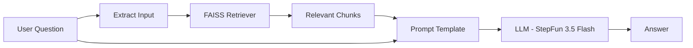

# Smart Contract Assistant

An AI-powered document assistant that lets you upload PDF/DOCX contracts and ask questions about them using Retrieval-Augmented Generation (RAG).

Built with **LangChain**, **FAISS**, **FastAPI**, and **Gradio**  using a free LLM via [OpenRouter](https://openrouter.ai) and local embeddings via Sentence Transformers.

---

## Demo

[](https://youtu.be/9GkqIfLd1Sw)


---

## Features

- **Document Ingestion** — Upload PDF or DOCX contracts, automatically chunked and embedded
- **RAG Chat** — Ask questions and get answers grounded in your documents
- **Local Embeddings** — Uses `all-MiniLM-L6-v2` (Sentence Transformers) 
- **LLM** — Uses `stepfun/step-3.5-flash` via OpenRouter
- **Professional Dark UI** — Clean, minimal Gradio interface 
- **FastAPI Backend** — RESTful API with Swagger docs at `/docs`

---

## Architecture

```
┌─────────────────────────────────────────────────────────────┐
│                        User Browser                         │
│                    http://localhost:7860                    |
└──────────────────────────┬──────────────────────────────────┘
                           │
                           ▼
┌─────────────────────────────────────────────────────────────┐
│                    Gradio Frontend (UI)                      │
│                       ui/app.py                              │
│                                                              │
│   ┌──────────────┐    ┌──────────────────────────────────┐   │
│   │  Upload Tab   │    │           Chat Tab               │  |
│   │  PDF / DOCX   │    │  Question → Answer (with history)│  |
│   └──────┬───────┘    └──────────────┬───────────────────┘   │
└──────────┼───────────────────────────┼───────────────────────┘
           │ POST /ingest              │ POST /rag/invoke
           ▼                           ▼
┌─────────────────────────────────────────────────────────────┐
│                  FastAPI Backend (API)                      │
│                    app/server.py                            │
│                  http://localhost:8000                      │
│                                                              │
│   ┌────────────────┐  ┌──────────────┐  ┌────────────────┐   │
│   │  /ingest       │  │ /rag/invoke  │  │  /summary/*    │   │
│   │  File upload   │  │ RAG chain    │  │  LangServe     │   │
│   └───────┬────────┘  └──────┬───────┘  └────────────────┘   │
└───────────┼──────────────────┼───────────────────────────────┘
            │                  │
            ▼                  ▼
┌───────────────────┐  ┌──────────────────────────────────────┐
│   Ingestion       │  │           RAG Chain                  │
│  app/ingestion.py │  │         app/chains.py                │
│                   │  │                                      │
│  PDF/DOCX Loader  │  │  Query → Retriever → Prompt → LLM    │
│       ↓           │  │                                      │
│  Text Splitter    │  │  ┌─────────────┐  ┌────────────────┐ │
│   (1000 chars)    │  │  │   FAISS     │  │  OpenRouter    │ │
│       ↓           │  │  │  Retriever  │  │  (StepFun 3.5) │ │
│  Embeddings       │  │  └─────────────┘  └────────────────┘ │
│  (MiniLM-L6-v2)   │  └──────────────────────────────────────┘
│       ↓           │
│  FAISS Index      │
│  (data/faiss_idx) │
└───────────────────┘
```

---

## RAG Pipeline



**How it works:**

1. User uploads a contract (PDF/DOCX)
2. Document is split into chunks (1000 chars, 200 char overlap)
3. Each chunk is embedded using `all-MiniLM-L6-v2` (384-dim vectors)
4. Embeddings are stored in a FAISS vector index
5. When the user asks a question, the most relevant chunks are retrieved
6. The question + context are sent to the LLM to generate a grounded answer

---

## Project Structure

```
smart-contract-assistant/
├── app/
│   ├── __init__.py          # Package init
│   ├── server.py            # FastAPI backend with API endpoints
│   ├── chains.py            # LangChain RAG & summary chains
│   ├── ingestion.py         # Document loading, splitting, embedding
│   └── vector_store.py      # FAISS index management
├── ui/
│   ├── __init__.py          # Package init
│   └── app.py               # Gradio frontend (dark theme UI)
├── data/
│   ├── uploads/             # Uploaded contract files (gitignored)
│   └── faiss_index/         # FAISS vector store (gitignored)
├── run.py                   # Starts both backend & frontend
├── start.bat                # Windows quick-start script
├── requirements.txt         # Python dependencies
├── .env.example             # Environment variable template
├── .gitignore               # Git ignore rules
└── README.md                # This file
```

---

## Tech Stack

| Component         | Technology                                                     |
| ----------------- | -------------------------------------------------------------- |
| **LLM**           | StepFun Step-3.5-Flash (free via [OpenRouter](https://openrouter.ai)) |
| **Embeddings**    | `all-MiniLM-L6-v2` (Sentence Transformers, local)             |
| **Vector Store**  | FAISS (CPU)                                                    |
| **Framework**     | LangChain                                                      |
| **Backend**       | FastAPI + Uvicorn                                              |
| **Frontend**      | Gradio 6.x (dark theme)                                       |
| **Orchestration** | LangServe (summary chain)                                     |
| **Language**      | Python 3.10+                                                   |

---

## LangServe

This project uses [LangServe](https://github.com/langchain-ai/langserve) to serve LangChain chains as REST API endpoints with built-in support for streaming.

**What LangServe provides:**

- **`/summary/invoke`** — Invoke the summary chain via LangServe
- **`/summary/stream`** — Stream summary results token-by-token
- **`/summary/batch`** — Batch multiple summary requests
- **`/summary/playground`** — Interactive web playground for testing the summary chain

**Streaming (RAG chain):**

The RAG chain is served via a custom `/rag/stream` endpoint using Server-Sent Events (SSE), enabling real-time token-by-token responses in the Gradio chat interface. The LLM is configured with `streaming=True` to support this.

```python

ChatOpenAI(
    model=MODEL_NAME,
    openai_api_key=OPENROUTER_API_KEY,
    openai_api_base="https://openrouter.ai/api/v1",
    streaming=True,  
)

```

## Getting Started

### Prerequisites

- Python 3.10 or higher
- An [OpenRouter](https://openrouter.ai) API key (free)

### 1. Clone the repository

```bash
git clone https://github.com/AhmedAbdelfatah111/MR-RAGQuery.git
cd MR-RAGQuery
```

### 2. Create a virtual environment

```bash
python -m venv venv

# Windows
venv\Scripts\activate

# macOS / Linux
source venv/bin/activate
```

### 3. Install dependencies

```bash
pip install -r requirements.txt
```

### 4. Set up environment variables

```bash
cp .env.example .env
```

Edit `.env` and add your OpenRouter API key:

```
OPENROUTER_API_KEY=sk-or-v1-xxxxxxxxxxxx
```

> Get a free API key at [openrouter.ai/settings/keys](https://openrouter.ai/settings/keys)

### 5. Run the application

```bash
python run.py
```

Or on Windows, double-click `start.bat`.

The app will start:
- **Backend API:** http://localhost:8000
- **Frontend UI:** http://localhost:7860
- **API Docs:** http://localhost:8000/docs

---

## Usage

1. Open **http://localhost:7860** in your browser
2. Go to the **Upload** tab and upload a PDF or DOCX contract
3. Click **Process Document** and wait for ingestion to complete
4. Switch to the **Chat** tab
5. Ask questions about your contract — the AI will answer based on the document content


---

## API Endpoints

| Method | Endpoint        | Description                    |
| ------ | --------------- | ------------------------------ |
| POST   | `/ingest`       | Upload and process a document  |
| POST   | `/rag/invoke`   | Ask a question (RAG)           |
| POST   | `/summary/invoke` | Summarize content (LangServe) |
| GET    | `/docs`         | Swagger API documentation      |

### Example API call

```bash
curl -X POST http://localhost:8000/rag/invoke \
  -H "Content-Type: application/json" \
  -d '{"input": "What are the payment terms?"}'
```

---

## Configuration

| Variable             | Description                        | Required |
| -------------------- | ---------------------------------- | -------- |
| `OPENROUTER_API_KEY` | OpenRouter API key for LLM access  | Yes      |

The LLM model can be changed in `app/chains.py` by modifying the `MODEL_NAME` variable. Any model available on [OpenRouter](https://openrouter.ai/models) can be used.

---

## License

GNU GPLv3 License
